# KeyBox 🔑

(*Для того чтобы принять участие в обсуждении проекта можете перейти по ссылке https://github.com/Bambuchachkin/KeyBox/discussions/1)

## Цель проекта 🎯
Создать устройство, предназначенное для одновременного хранения ~ 10 ключей от
аудиторий в корпусах МФТИ. Оснастить его системой автоматического контроля
доступа к ключам через карты-пропуска. Вести учёт пользователей и времени, которое
ключи были у них на руках.

### Принципиальная схема цепи и взаимодействия ее компонент:

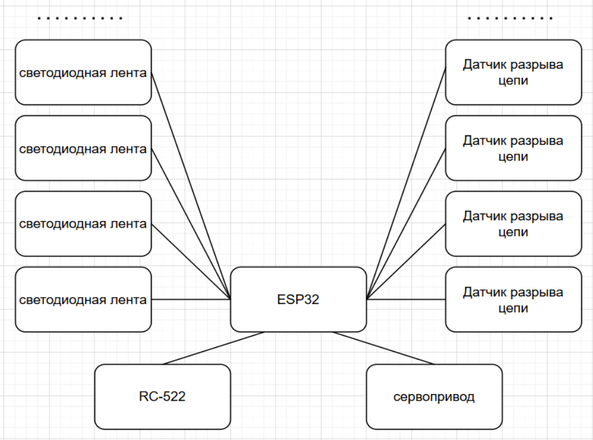

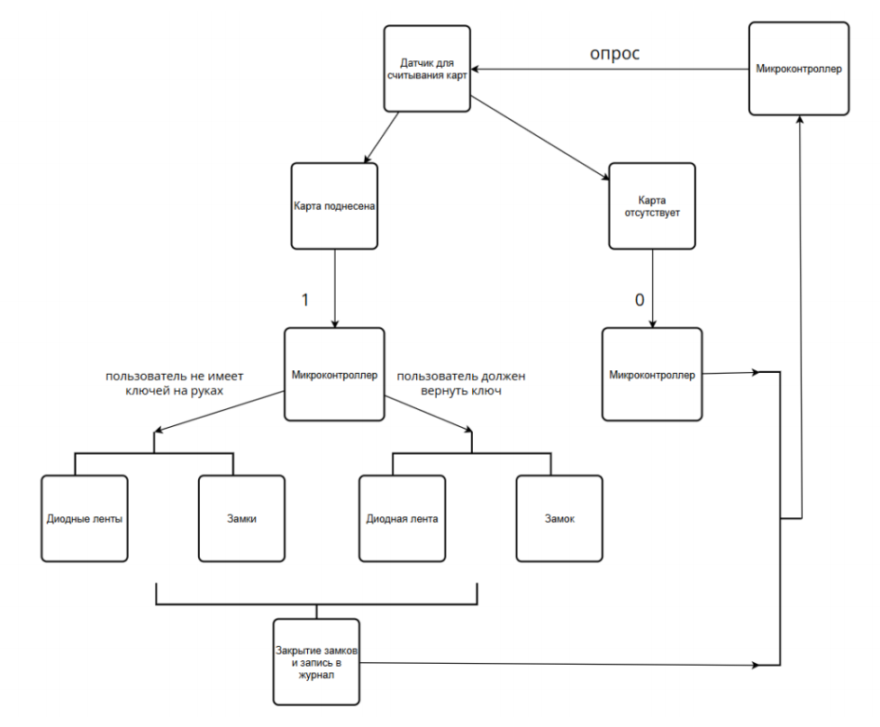

## Ход работы

### Особенности физтеховских карт-пропусков:
<table>
<tr>
<td style="border: none;">

Наименование: mifare classic 1k

Рабочая частота: 13.56 МГц

Требует аутентификации: Для данных, но не для UID

</td> </tr> </table>

### Взаимодействие с картой:
Общение с картами будет осуществлятся при помощи считывателя RC522.
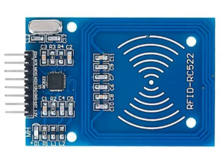

### Работа в материале

Схема работы детектирующего устройства:
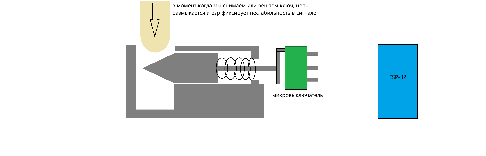

Модель крюка:
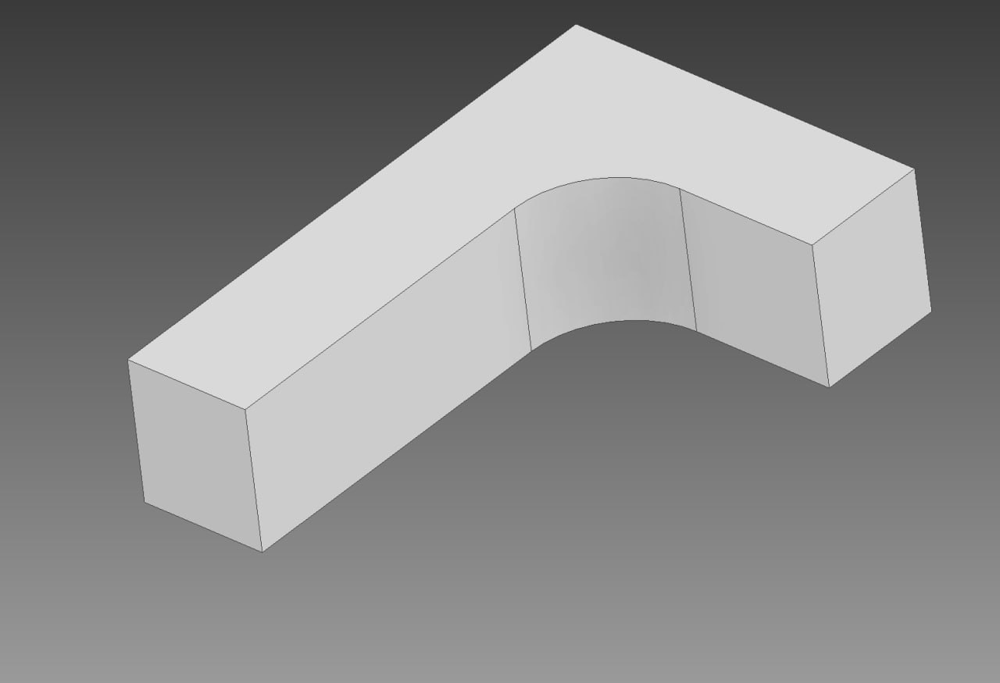

Модель штифта:
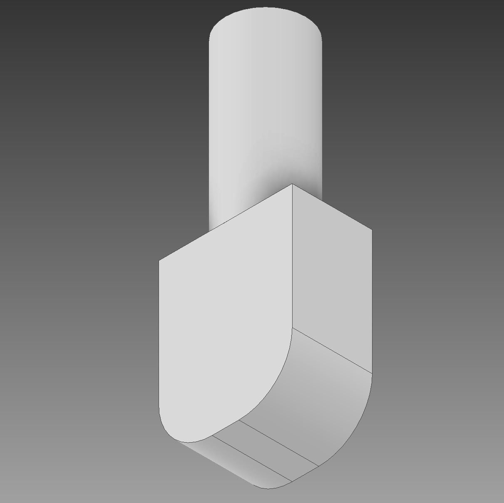

Модель базы для установки крюка:
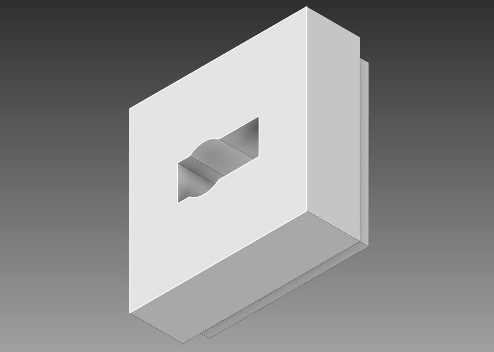

Модель корпуса ключницы:

### Написание кода
Реализация взаимодействия с RC522:
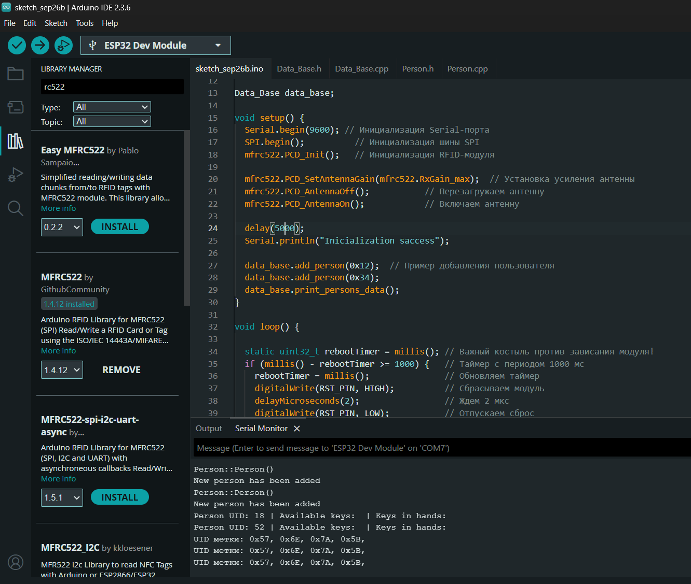

Реализация обработки команд с консоли:
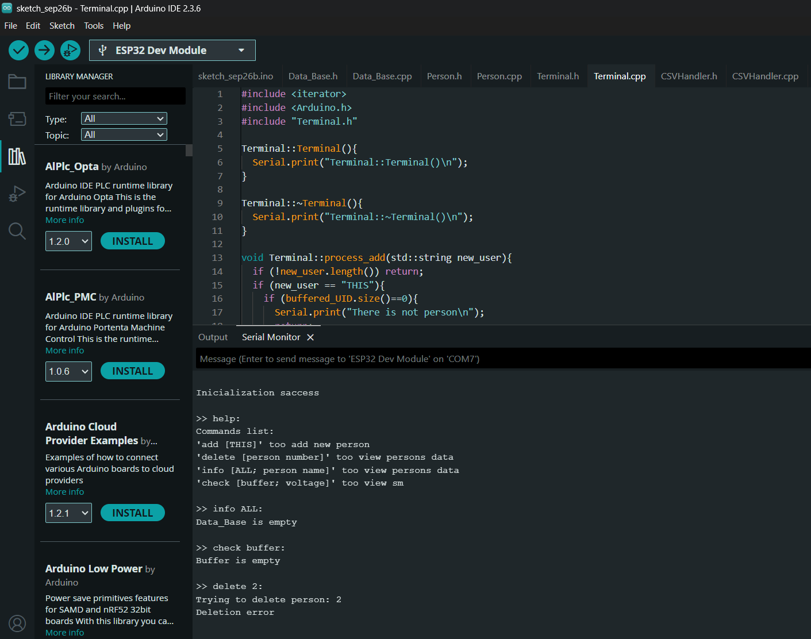

Реализация работы с пользователями:
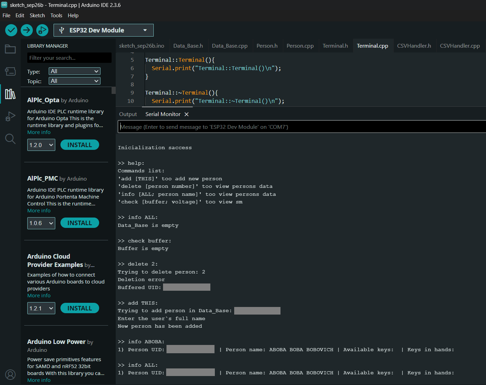

Разработка структуры хранения данных:

Реализация чтения и записи данных в таблицу (тестовые отправки):

Реализация хранения и восстановления данных из постоянной памяти:
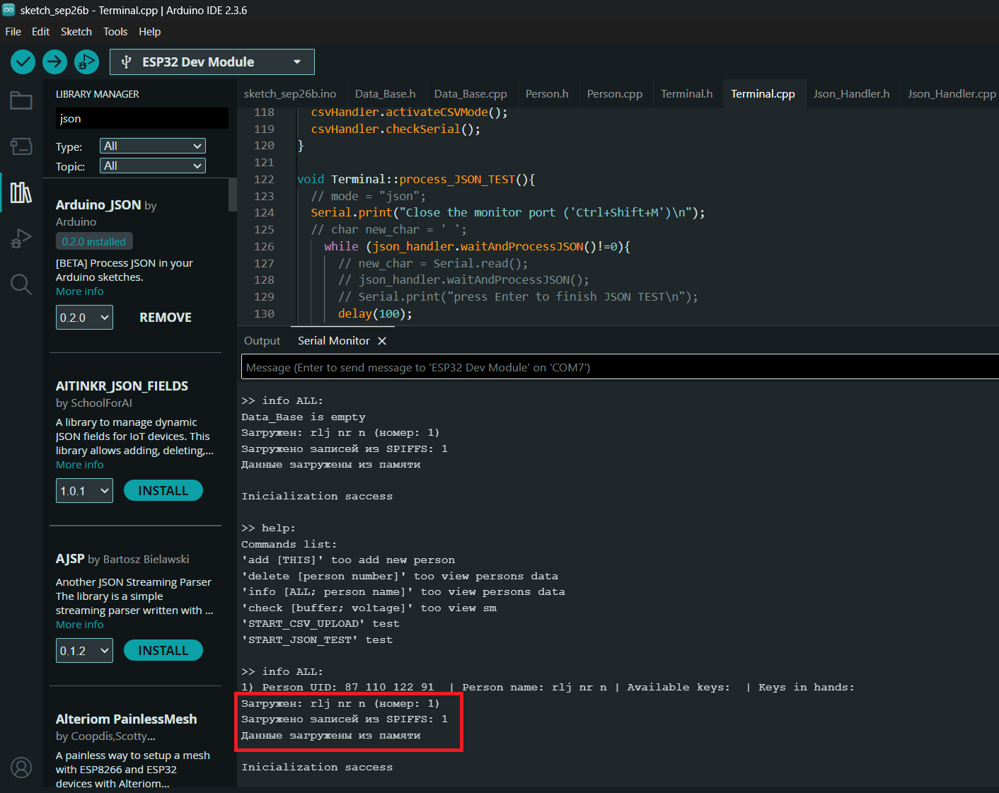

Добавлен кармашек для  зажима микропереключателя:

Доработана основная платформа для закрепления кармашка в ней, так же увеличен радиус отерстия для пружинки:

Сделан корпус из дерева (дополнительные отверстия будут делаться на физтех-фабрике)

Реализация чтения данных пользователей из таблицы (предитоговая версия):
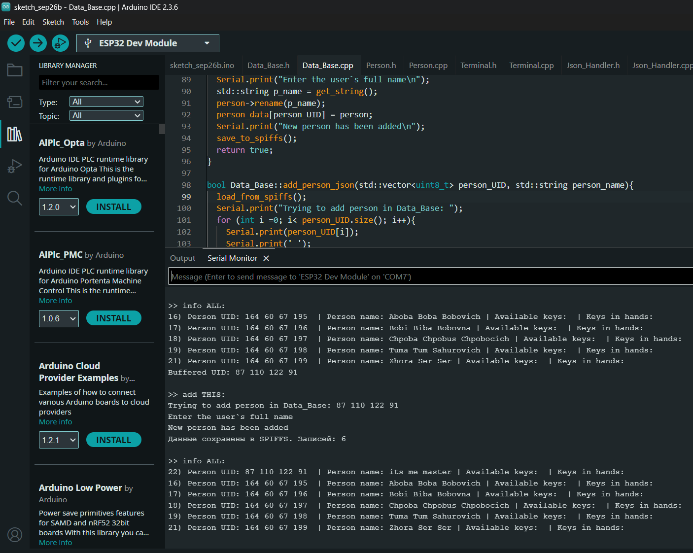

Окончательная реализация чтения данных пользователей из таблицы:
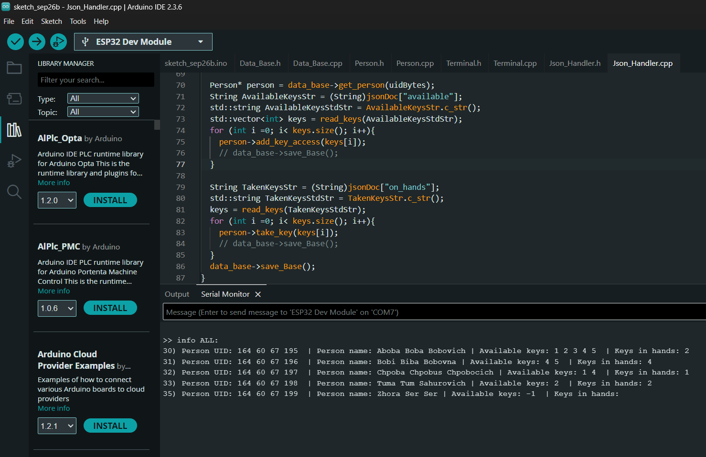

Сборка и тестирование 2ух узлов схемы + отладка кода:
