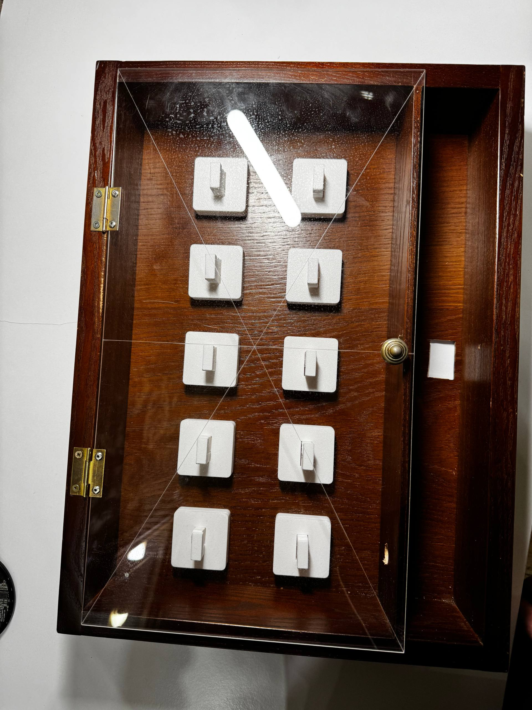
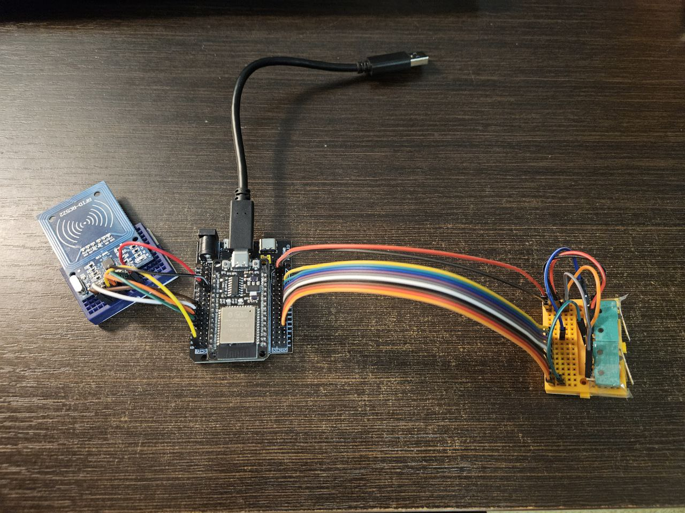

# KeyBox 🔑

(*Для того чтобы принять участие в обсуждении проекта можете перейти по ссылке https://github.com/Bambuchachkin/KeyBox/discussions/1)

## Цель проекта 🎯
Создать устройство, предназначенное для одновременного хранения ~ 10 ключей от
аудиторий в корпусах МФТИ. Оснастить его системой автоматического контроля
доступа к ключам через карты-пропуска. Вести учёт пользователей и времени, которое
ключи были у них на руках.

## Итоги работы ✨

### По итогам работы нашей команде удалось выполнить все поставленные цели:
1. ✅ Создано устройство для хранения 10 ключей
2. ✅ Установлен замок для ограничения доступа к ключам
3. ✅ Инсталирована светодиодная лента для улучшения пользовательского опыта
4. ✅ Реализована работа с картами-пропусками
5. ✅ Спроектирована база данных пользователей
6. ✅ Налажена работа с таблицами формата .xlsx для удобства работы с устройством
7. ✅ Разработаны методы работы с устройством с помощью консоли
8. *30.11.2025 Финальная сборка не закончена по причине нахождения электронных компонентов на другом конце Москвы от корпуса устройства (сборка будет завершена в ближайшее время)

### Решенные проблемы: 🔧
В процессе работы возникали проблемы различного уровня сложности. Среди наиболее острых, но разрешенных оказались:
1. Механизм открытия и закрытия двери, требующий от пользователя минимум действий, а именно приложить карту-пропуск и захлопнуть дверцу после взятия/возвращения ключа. Механизм был реализован при помощи системы: сервопривод, штифты и клинья, возвратные пружины.
2. Реализация наиболее удобных способов взаимодействия персонала с устройством. Такими являются консольное взаимодействие для быстрой регистрации и редактирования профилей пользователей и exel-таблицы для обработки базы данных и журнальных записей (приходы, уходы, взятые ключи).

### Возможное развитие проекта: 🚀
Полученное изделие имеет массу возможностей для улучшения:
1. Дистанционное взаимодействие посредством сети wi-fi
2. Оповещающие устройства (сигнальный динамик, информирующий дисплей)
3. Система автономного реагирования (автоматические ограничения для недобросовестных пользователей)

## Далее вы можете более подробно ознакомиться с историей развития проекта 📖

### Принципиальная схема цепи и взаимодействия ее компонент:

## Ход работы

### Особенности физтеховских карт-пропусков:
<table>
<tr>
<td style="border: none;">

Наименование: mifare classic 1k

Рабочая частота: 13.56 МГц

Требует аутентификации: Для данных, но не для UID

</td> </tr> </table>

### Взаимодействие с картой:
Общение с картами будет осуществлятся при помощи считывателя RC522.

### Работа в материале

Схема работы детектирующего устройства:

Модель крюка:

Модель штифта:

Модель базы для установки крюка:

Модель корпуса ключницы:

### Написание кода
Реализация взаимодействия с RC522:

Реализация обработки команд с консоли:

Реализация работы с пользователями:

Разработка структуры хранения данных:

Реализация чтения и записи данных в таблицу (тестовые отправки):

Реализация хранения и восстановления данных из постоянной памяти:

Добавлен кармашек для  зажима микропереключателя:

Доработана основная платформа для закрепления кармашка в ней, так же увеличен радиус отерстия для пружинки:

Сделан корпус из дерева (дополнительные отверстия будут делаться на физтех-фабрике)

Реализация чтения данных пользователей из таблицы (предитоговая версия):

Окончательная реализация чтения данных пользователей из таблицы:

Сборка и тестирование 2ух узлов схемы + отладка кода:
