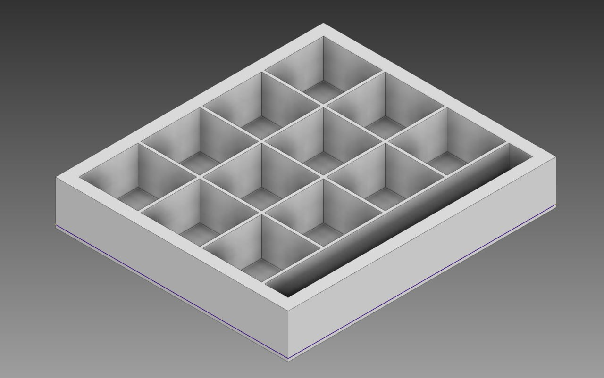
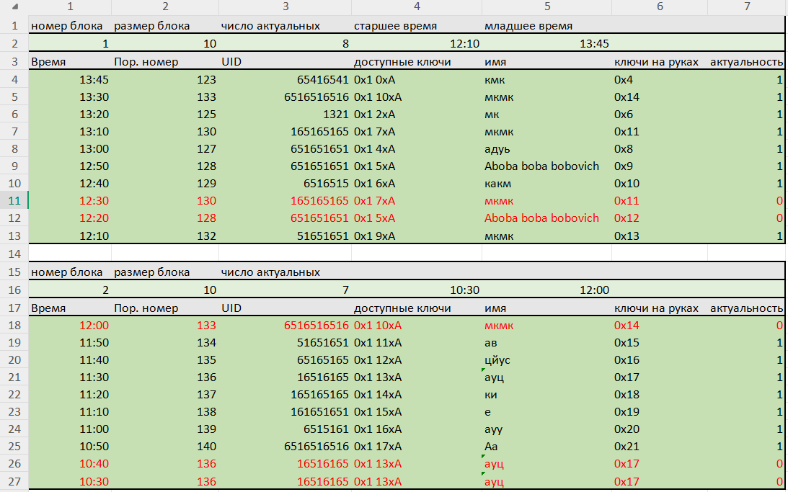

# KeyBox

(*Для того чтобы принять участие в обсуждении проекта можете перейти по ссылке https://github.com/Bambuchachkin/KeyBox/discussions/1)

## Цель проекта:
Создать устройство, предназначенное для одновременного хранения ~ 10 ключей от
аудиторий в корпусах МФТИ. Оснастить его системой автоматического контроля
доступа к ключам через карты-пропуска. Вести учёт пользователей и времени, которое
ключи были у них на руках.

### Принципиальная схема цепи и взаимодействия ее компонент:

## Ход работы

### Особенности физтеховских карт-пропусков:
<table>
<tr>
<td style="border: none;">

Наименование: mifare classic 1k

Рабочая частота: 13.56 МГц

Требует аутентификации: Для данных, но не для UID

</td> </tr> </table>

### Взаимодействие с картой:
Общение с картами будет осуществлятся при помощи считывателя RC522.

### Работа в материале

Схема работы детектирующего устройства:

Модель крюка:

Модель штифта:

Модель базы для установки крюка:

Модель корпуса ключницы:

### Написание кода
Реализация взаимодействия с RC522:

Реализация обработки команд с консоли:

Реализация работы с пользователями:

Разработка структуры хранения данных:

Реализация чтения и записи данных в таблицу:
(В процессе ...)